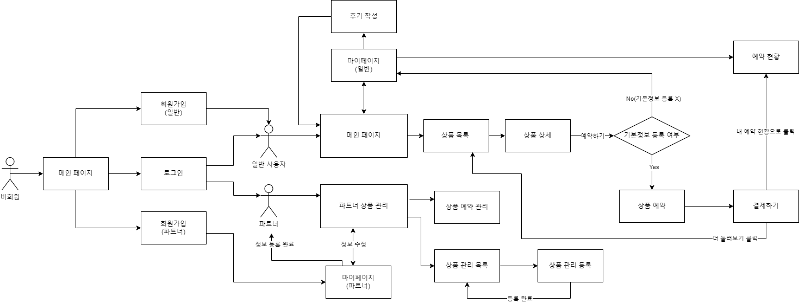

# TravelPort:49105


## 🔎 Introduction

### ❓ Why TravelPort:49105?

> 여행과 관련된 포털 서비스를 의미하며, 숫자 "49105"는 한국어로 "사구싶오"라고 발음됩니다.
> "Port"라는 단어에는 두 개의 의미가 내포되어 있습니다.
> 하나는 '항구'로, 여행과 모험의 시작점이라는 상징적인 의미를 지닙니다.  
> 또 다른 의미로 "Port"는 네트워크 상에서 데이터의 송수신을 가능하게 하는 기술적 수단을 의미하여,
> 사용자들이 서로 여행 계획을 공유하고 협력할 수 있도록 돕는 중요한 수단으로의 역할을 합니다.

## 👨‍👩‍👧‍👦 Members

### 🖥 Front-End

|  |  |  |  |  |
| :-------------------------------------------------------------------------------------: | :--------------------------------------------------------------------------------------: | :--------------------------------------------------------------------------------------: | :--------------------------------------------------------------------------------------: | :--------------------------------------------------------------------------------------: |
|                   [하태훈 _Team leader_](https://github.com/Hooni07)                    |                         [강영훈](https://github.com/harrykotter)                         |                           [박지윤](https://github.com/hijiyun)                           |                          [변지인](https://github.com/byunjiin)                           |                         [이유진](https://github.com/eugene9851)                          |

### 🗄 Back-End

|  |  |
| :----------------------------------------------------------------------------------------: | :---------------------------------------------------------------------------------------: |
|                          [오승준](https://github.com/tmdwns1521)                           |                           [오영곤](https://github.com/ohddang)                            |

### 🧹 Designer

|  |
| :---------------------------------------------------------------------------------------: |
|                           [김은지](https://github.com/edmsjwl)                            |

## 🚀 Stacks


## 💅 Linting


## 📚 Libraries


## 🌏 Co-work Tools


## Member Rolls

<details><summary>🐯 하태훈</summary>

**공용 컴포넌트**

1. **Button**
   - 일반, Outlined, Floating, 더보기 디자인을 구현, variant 등의 props를 통해 다양한 디자인 적용 가능하도록 설정
2. **InputBox**
   - email, password, 전화번호 등 비교적 적은 양의 입력이 필요한 경우 사용하도록 하는 component
   - react-hook-form 적용 가능
   - 일반 input design, error 시 design 구현
3. **TextBox**
   - 예약 거절 사유 작성, 본인 소개 등 비교적 많은 양의 입력이 필요한 경우 사용하도록 생성한 component
   - react-hook-form 적용 가능

**Review 컴포넌트**

- 후기(review) 작성 시 제품 페이지에서 확인할 수 있는 card 컴포넌트
- 각 리뷰별 평점 평균 및 리뷰 평점 분포 그래프 디자인 적용
- user 및 리뷰 이미지, 사용 제품 옵션 및 리뷰 내용 포함

**로그인, 회원가입 페이지**

- React-hook-form을 사용하여 필수 입력 항목 및 에러 메시지 설정
  - 로그인 : email, password
  - 회원가입 : 닉네임(user), 기업/법인명(partner), email, password, passwordCheck
- OAuth 소셜 로그인 적용(Google, Kakao, Naver)
- 일반 유저, 파트너 유저별 회원가입 페이지 별도 생성

**파트너 예약 관리 페이지**

- 파트너-마이페이지 내 예약 관리
- 상태 : 대기중, 승인됨, 거절됨 구분
- 승인하기
  - 대기중 → 승인됨으로 상태 변경
  - 취소하기 버튼 : 승인됨 → 대기중 상태로 변경
  - 거절하기 버튼 : 승인됨 → 거절됨 상태로 변경
- 거절하기
  - 대기중 → 거절됨으로 상태 변경
  - 사유 작성 버튼
    - reservation API의 PUT method 활용(cancelMsg 수정을 위해)
    - 거절하기 버튼 클릭 시, 거절 사유(cancelMsg) 작성을 위한 modal 동작, modal을 통해 cancelMsg 작성 후 해당 내용 반영
- 취소하기(승인됨 상태에서)
  - 예약 승인 상태에서 예약 대기 상태로 변경

**파트너 게시물 관리 페이지**

- 파트너-마이페이지 내에서 파트너가 게시한 상품에 대한 상품 확인 및 게시 상태 수정(게시중/게시중지) 및 삭제 구현
  - 게시중/게시중지 switch : product API의 PUT method 활용(isPosting state를 변경하기 위해), 스위치 상태 변경에 따라 게시한 상품의 게시중, 게시중지 상태를 조절
  - 삭제하기 버튼 : product API의 DELETE method 활용, 버튼 클릭 시 modal을 통해 다시한번 삭제 여부 확인, 삭제하기 버튼 클릭 시 해당 상품에 대한 정보 삭제
  </details>

<details><summary>🎀 박지윤</summary>

1. **메인 페이지**
   - 캐러셀 라이브러리를 사용하지 않고, 커스텀 훅을 활용하여 구현했습니다.
   - 별점 순으로 정렬하여 리뷰가 3개 이상인 상품 카드를 렌더링했습니다.
   - 화면 크기에 따라 PC에서는 4개, 태블릿에서는 3개, 모바일에서는 1개의 카드를 보여주도록 구현했습니다.
   - 카드 컴포넌트에는 스켈레톤 UI를 적용했습니다.
2. **검색결과 페이지**
   - 인기순, 추천순, 가격순으로 필터링할 수 있는 커스텀 훅을 작성했습니다.
3. **결제 페이지**
   - 토스 페이먼츠를 이용하여 결제 기능을 구현했습니다.
4. **장바구니 페이지**
   - 각 상품의 이미지, 리뷰, 옵션, 날짜, 가격을 렌더링했습니다.
   - 체크박스로 선택한 상품들의 가격을 합산하여 최종 결제 금액으로 state에 반영했습니다.
   - 상품 삭제 시 바로 업데이트되어 화면에 반영될 수 있도록 refetch 기능을 구현했습니다.
5. **결제 성공 페이지**
   - 결제가 성공적으로 완료되면 예약과 결제 API를 호출하여 실제 핸드폰으로 결제 완료 알림을 받을 수 있습니다.

추가 컴포넌트:

1. **Header 컴포넌트**
   - 사용자 타입에 따라 다른 헤더를 구현
   - 모바일 화면에서는 햄버거 버튼을 클릭하여 사이드바를 토글할 수 있습니다.
   - 외부 클릭 시 사이드바가 닫히도록 하는 커스텀 훅도 작성하였습니다.
2. **Footer 컴포넌트**
3. **404 페이지**
4. **서비스 준비중 페이지**
5. **로딩 스피너 컴포넌트**
</details>

<details><summary>🍏 변지인</summary>

- **card 컴포넌트**
    - card내부에 들어갈 내용들을 인자로 설정+이미지는 Lorem Picsum로 임시이미지 사용+별점 계산
- **KaKaoMap + DaumPostcode 컴포넌트**
    - 위치를 검색(kakaoMap)하고 나타내기(daumpostcode) 위해 사용
    - 사용자에게 명확한 위치를 나타내기위한 mapmarker 구현
    - 서버와 로컬스토리지에 해당 위도,경도,주소,상세주소 저장
- **페이지네이션**
    - 한번에 보일 숫자들 구현 ( pc, 템플릿)
        - 1~5개 : < 1 2 3 4 5 > *모바일은 3까지
        - 6~10개 : << < 1 2 3 4 5 6 7 8 9 10 > >> *모바일은 5까지
        - 10개 이상 : << < 11 12 13 14 15 16 17 18 19 20 > >> 같은 로직으로 반복
    - 현재 페이지 의미
    : 숫자는 고정되어있고 현재페이지를 숫자에 바꿔보여줌
        - 현재페이지 : 파란색 원으로 숫자 주위를 표시
        - 그 이외 : 흰색으로 숫자만 표시
        - hover효과 : 하늘색 원으로 숫자 주위를 표시
    - 그룹화하여 화살표의 의미 정하기
        - < 단순 1칸 앞( 2일땐 1로, 11일땐 페이지 바뀌며 10로)
        - \> 단순 1칸 뒤 ( 1일땐 2로, 10일땐 페이지 바뀌며 11로)
        - << 가장 처음 페이지로 이동(1~30페이지면 1로 이동)
        - \>\> 가장 마지막 페이지로 이동(1~30페이지면 30로 이동)
        ex) 8페이지에서 11로 이동하고 싶다면, ‘10’을 한번 누르고 ‘>’ 누르고 ‘11’로 이동
    - 페이지 갯수만큼 버튼 만들기
        - 상위 CardSample에서 총 card수와 화면에 표출할 수를 받아와서, 총/표출 수로 반복문
        - 반복문안에 직접 버튼을 넣어 만들기
    - ***페이지네이션 설명하고싶은부분 코드***
      
        1. CardSample에서 아래를 인자로 받아옴
        
        ```tsx
        pageNum={pageNum} // 현재 페이지의 버튼 숫자
        setPageNum={setPageNum} // 현재 페이지 버튼 숫자 값이 들어가는 변수
        allCardNum={96} // 전체 카드량
        divNum={limit} // 한 페이지에 몇장의 카드가 보여질지 정하는 수
        ```

        
        2. buttonNum생성 : 페이지네이션 할 전체 버튼을 의미
        
        ```tsx
        const buttonNum = Math.ceil(allCardNum / divNum);
        // ex) 20/6 => 4개의 페이지가 생성되고, 1~3은 6개의 카드가 들어가지만 4번째 페이지에는 2개
        ```
        
        3. bigButtonNum생성 : 그룹을 나누고, 그 그룹에 대한 상세 설정 
        
        ```tsx
        const [bigButtonNum, setBigButtonNum] = useState(1); // 버튼을 그룹으로 나누기위한 숫자 (1~10페이지면 1그룹, 11~20페이지면 2그룹)
        
        useEffect(() => { // 현재 페이지가 속한 그룹정하는 방법
            if (pageNum % 10 === 1 || pageNum % 10 === 0) { // 새로운 그룹에 들어갈때 (10->11, 11->10)
              setBigButtonNum(Math.ceil(pageNum / 10)); // 그룹설정
            }
            if (pageNum === buttonNum) { // 마지막 페이지 일때
              setBigButtonNum(Math.ceil(buttonNum / 10)); // 그룹설정
            }
          }, [pageNum]); // if를 같은 로직이라 묶음
        ```
        
        4. PageButton()를 통해 각 상황에 맞는 버튼을 갯수만큼 생성
        
        ```tsx
        const PageButton = () => {
            const buttonList = []; // 값이 1개 이상이기에 배열에 담아 표출
            for (
              let i = 1;
              i <= (bigButtonNum === Math.ceil(buttonNum / 10) ? buttonNum % 10 : 10); // 마지막 그룹에선 10개가 다 나오는게 아니라, 필요한 만큼만 나오게
              i++
            ) {
              buttonList.push( // 배열에 넣는거니깐 이렇게 구현
                <button
                  className={
                    pageNum === (bigButtonNum - 1) * 10 + i
                      ? twMerge(buttonStyle, `bg-blue-6 text-white`)
                      : buttonStyle
                  }
                  type="submit"
                  key={`button${(bigButtonNum - 1) * 10 + i}`}
                  onClick={() => SendPageButton((bigButtonNum - 1) * 10 + i)}
                >
                  {(bigButtonNum - 1) * 10 + i}
                </button>,
              );
            }
            return buttonList; // for가 끝나고 리턴해야 다 들어옴
          };
        ```
        
        ## 새로 알게 된 점
        
        - PageButton은 총 Card갯수/화면에 표출될 수 만큼 반복문을 실행하는 함수. 이 반복문을 통해 button을 하나 하나 만들어가야함.
  
            - 알게된점 : jsx에 의해 push안에는 <>태그도 들어감 → i만 뽑는게 아니라 여기 자체에서 button에 i를 넣어 반복문을 돌릴 수 있게 됨
  
            - 알게된점 : react에서는 배열을 랜더링 하면 자연스럽게 []이 벗겨진 채로(=요소들만 나오도록) 설정되어있음

- **상품 등록 페이지**
    - partner계정으로 들어가지는 페이지(/partner)
    - 한페이지 내부에 5개의 하위페이지가 들어가기에, 서버로 보내기 전 로컬스토리지나 주스탄드, useState를 통해 상태관리를 하고(새로고침, 뒤로가기 등 사용자가 마지막페이지 게시하기를 누르기 전까지의 데이터를 저장해줌) 마지막 페이지에서 게시할때, 모든 정보가 보내지며, 사용자 화면에선 사라지도록 구현한 페이지
    - **checkbutton 컴포넌트**(다음버튼)
    - **numberInput 컴포넌트**(타입이 number인 input)
    - 모든 페이지 input엔 **useForm**사용하여 그 기능들을 활용(isValid-버튼disabled판단, register, handleSubmit, watch, setValue 등)
    - **sidebar컴포넌트** : 객체형식으로 키와 타입을 주고, 각 항목별로 판별하도록 구현
        - 현재페이지에 맞도록 로직 연결(navigater사용, 파란hover로 표시)
        - 지나간 페이지는 체크표시
        - 헤더대신 메인으로 갈 수 있는 로고 연결
        - useState를 사용하고 상품등록하위페에지들에 인자로 전달하여 상태관리
    - **상품유형설정페이지**(로컬스토리지에 저장)
        - 카테고리를 필수로 선택하고 이를 통해 이후 상품등록페이지의 하위페이지들을 진행
        - 카테고리에 맞게 하위옵션 표출, 명칭을 일치시켜 필터링때 적용
    - **제목, 설명, 대표이미지등록 및 상품사진 등록 페이지**(로컬스토리지+주스탄드)
        - descrip페이지
            - 제목, 설명은 useForm을 사용해서 값을 감시하여 로컬스토리지에 저장, 이미지는 주스탄드로 상태관리 후 presignURL을 통해 버킷에 들어감.
            - 모달에서 지정한 사진을 미리보기로직을 통해 구현
        - 이미지모달페이지 (❤️가장적고싶은페이지)
            - 이미지모달에서 map을 이용하여 5개 이하의 사진을 등록, 삭제, 수정 하는 로직 구현
        - ***이미지등록 페이지 설명하고 싶은 부분 코드***
            
            ```tsx
            //이미지 모달에서 map도는 부분
            const showImage = () => {
                return imageArray.map((file: any, index: number) => {
                  return (
                    <div
                      key={file.name}
                      className="flex  bg-white border border-black-4 items-center p-12 rounded justify-between"
                    >
                      <div className="flex gap-12 items-center">
                        
                        <p>{file.name}</p>
                      </div>
                      <div className="flex gap-12 items-center">
                        <label className="flex gap-8" htmlFor="check">
                          <input
                            id="check"
                            type="radio"
                            {...register('check')}
                            value={index}
                          />
                          대표
                        </label>
                         {
                            const temp = [...imageArray];
                            temp.splice(index, 1); // 배열에서 선택한 인덱스를 삭제해서 배열을 재정의
                            setImageArray(temp); // 재정의된 배열을 set안에 넣어서 재정의+state변환
                          }}
                        />
                      </div>
                    </div>
                  );
                });
              };
            ```
            
    - **위치 페이지**(로컬스토리지)
        - KaKaoMap + DaumPostcode 컴포넌트를 이용하여 주소저장하는 버튼에 값이 들어가고 로컬스토리지를 통해전달
    - **날짜 페이지**(로컬스토리지)
        - Calender 컴포넌트를 사용해서 시작일, 종료일 표출
        - 휴무일은 중복체크가 허용되기에 map을 사용해서 새로운 배열을 만들고 다시 map을 돌아서 setValue에 값을 담아 판단하는 로직 구현
    - **상품상세옵션페이지(로컬스토리지+서버)** (❤️가장적고싶은페이지)
        - 옵션페이지
            - useState로 optionList를 만들어, 옵션을 생성하는 옵션모달페이지에 인자로 전달하여 값을 받아와서 map을 돌고 비동기 작업을 통해 반환
            - table을 통해 받아올 값의 위치를 정하고 관리
        - 옵션모달페이지
            - 숙소, 체험에 따라 다른 옵션 보여주기
            - numberinput컴포넌트를 사용
        - 게시하기버튼
            - api가 3개로 나눠져있어서, 3단계로 나눠서 서버에 post(❤️가장적고싶은페이지)
            - 앞의 상품하위페이지들(유형설정,제목,설명,이미지등록,위치,날짜,옵션자체)에 값이 없다면 disabled
            - 누르면 게시전 임시저장된 데이터들 리셋
            - ***사용한 코드***
                
                ```tsx
                const onSubmitAll = async () => {
                    // 여기에 서버로 전송할 데이터를 모두 모아 보냄
                    try {
                      // 1. 카테고리를 서버에 등록
                      const categoryResponse = localStorage.getItem('categoryId');
                      const handleUploadThumbnail = async () => {
                        const thumbnailResponse = await postImages(
                          [thumbnail],
                          BUCKER_NAME.ADDITIONAL_PRODUCT,
                        );
                        return thumbnailResponse[0];
                      };
                      const handleUploadProduct = async () => {
                        const productImagesResponse = await postImages(
                          productImages,
                          BUCKER_NAME.ADDITIONAL_PRODUCT,
                        );
                        return productImagesResponse;
                      };
                      // 로컬에서 받아오는 데이터
                      const productInfo = {
                        name: name !== null ? name : '', // 상품명을 여기에 입력
                        productType: productType !== null ? productType : '', // 상품 타입, 여러 개의 타입이면 배열로 전달
                        productDesc: productDesc !== null ? productDesc : '', // 상품 설명
                        productSiteLat:
                          productSiteLat !== null ? parseFloat(productSiteLat) : 0, // 상품 위치의 위도
                        productSiteLng:
                          productSiteLng !== null ? parseFloat(productSiteLng) : 0, // 상품 위치의 경도
                        productAddress: productAddress !== null ? productAddress : '', // 상품 주소
                        buildingName: buildingName !== null ? buildingName : '', // 건물 이름
                        thumbnail: await handleUploadThumbnail(), // 썸네일 이미지 URL
                        productImages: await handleUploadProduct(), // 상품 이미지들의 URL 배열
                        startDate: startDate !== null ? formatDate(new Date(startDate)) : '', // 시작 날짜 (예: '2024-06-18')
                        endDate: endDate !== null ? formatDate(new Date(endDate)) : '', // 종료 날짜 (예: '2024-06-20')
                        closedDay: holiday !== undefined ? holiday : [''], // 휴무일 배열
                      };
                      // 2. 로컬을 바탕으로 상품을 서버에 등록
                      if (categoryResponse) {
                        const productResponse = await product.postProduct(
                          id !== null ? id : 1,
                          parseInt(categoryResponse, 10),
                          productInfo,
                        );
                        if (productResponse.data.id) {
                          // 3. 상품 옵션을 서버에 등록(option페이지에있는거 그대로 사용)
                          /* eslint-disable array-callback-return */
                          const promise = optionList.map(async (option) => {
                            const handleUploadOption = async () => {
                              const optionResponse = await postImages(
                                [option[0]],
                                BUCKER_NAME.PRODUCT_OPTION,
                              );
                              return optionResponse[0];
                            };
                            const optionInfo = [
                              {
                                productId: productResponse.data.id,
                                optionName: option[1], // 옵션 이름
                                optionDesc: option[7], // 옵션 설명
                                optionPrice: parseInt(option[4], 10), // 옵션 가격
                                optionImage: await handleUploadOption(), // 옵션 이미지 URL
                                minUserCount: parseInt(option[2], 10), // 최소 참여 인원
                                maxUserCount: parseInt(option[2], 10), // 최대 참여 인원
                                userCount: parseInt(option[3], 10), // 티켓 갯수
                                timeTable: [
                                  {
                                    startTimeOnly: `${option[5]}`, // 시작 시간
                                    endTimeOnly: `${option[6]}`, // 종료 시간
                                  },
                                ],
                              },
                            ];
                            return instance.post('/productOption', optionInfo); // 각 옵션에 대한 비동기 작업을 반환
                          });
                          Promise.all(promise)
                            .then(() => {
                              // results
                              toast.success('모든 옵션이 성공적으로 등록되었습니다.');
                            })
                            .catch(() => {
                              // error
                              toast.error('옵션 등록 중 오류가 발생했습니다.');
                            });
                          localStorage.removeItem('categoryId');
                          localStorage.removeItem('title');
                          localStorage.removeItem('subCategory');
                          localStorage.removeItem('content');
                          localStorage.removeItem('x');
                          localStorage.removeItem('y');
                          localStorage.removeItem('addressName');
                          localStorage.removeItem('buildingName');
                          localStorage.removeItem('startDate');
                          localStorage.removeItem('endDate');
                          localStorage.removeItem('holiday');
                          navigation('/partner');
                        }
                      }
                    } catch (error) {
                      toast.error('상품 및 옵션 등록 중 오류가 발생했습니다.');
                    }
                  };
                ```
                
        - 상품관리페이지에 연동
            - userId가 로컬스토리지에 문자열로 들어있어 정규표현식을 사용해서 id값을 추출
            - ***사용한 코드***
                
                ```tsx
                const extractId = (str: any) => {
                    const regex = /"id":(\d+)/;
                    const match = str.match(regex);
                    return match ? parseInt(match[1], 10) : null;
                  };
                  
                  const id = extractId(localStorage.getItem('user-info'));
                ```
</details>

<details><summary>💎 이유진</summary>

- SearchBar 컴포넌트
  - useSearchData 훅을 통해 연관검색어 데이터, 검색어 등 리턴
  - 서치 후에도 서치바에 검색어 남아있도록 구현 : URLSearchParams 활용
  - 연관검색어 클릭하거나 엔터 시 검색결과페이지로 navigate
- Calendar 컴포넌트
  - react-datepicker library 활용
- 상품 목록 페이지
  - 숙박용 카드
  - 필터링
    - 인원수, 가격, 날짜, 상품 종류 필터링 구현
- 상품 상세 페이지
  - 예약 탭
    - 일정 / 회차(옵션) / 수량 미 입력 시 버튼 disable
    - 날짜
      - 카테고리가 체험이면 하나의 날짜만 선택 가능하도록 구현
      - 카테고리가 숙박이면 입실 날짜와 퇴실 날짜 선택 가능하도록 구현
    - 옵션
      - 남은 티켓이 없으면 disable & 마감 처리
    - 결제하기 클릭 시 결제하기 페이지로 바로 이동 : zustand 활용
    - 장바구니 담기 클릭 시 해당 상품이 장바구니에 담긴 후 페이지 이동 여부를 묻는 모달창 open : react-query mutation 활용
  - 상품상세 탭
  - 리뷰 탭
    - 특정 상품에 대한 리뷰 데이터 불러오기
- 리뷰 작성 페이지
  - react-hook-form 사용하여 필수 입력 항목 및 에러 메시지 설정
  - 필수 입력 항목 미입력 시 제출 버튼 disable
  - 별점
    - 왼쪽부터 점수에 해당하는 별 클릭 시 배경색 채워짐 & 점수 넘김
  - 이미지 업로드
    - UI 상 보이는 이미지, post용 이미지 state로 관리
    </details>

<details><summary>🌠 강영훈</summary>

- 유저, 파트너 마이페이지
- 유저, 파트너 정보 수정
- 비밀번호 변경
- 파트너 메인페이지
- 모달 컴포넌트
  - 공용 모달 컴포넌트
  - 기본 모달 컴포넌트
- 토스트 기능 - 라이브러리
- 예약 공용 페이지네이션
- 이미지 업로드
  - S3 프리사인드url을 통한 다수 이미지 업로드 기능 구현
- 유저 정보 관리
- JWT 토큰 디코딩을 통한 유저 정보 관리
- zustand 사용자 정보 관리
- README.md 작성
</details>

## 👤 User flow



## 📖 Page preview

## ❗ Trouble Shooting

### 💔 잦은 팀원 교체 이슈

#### 🤷‍♂️ 문제점

- 초기에 개인 사유로 백엔드, 디자이너 하차
- 이후 디자인 작업 진척도, 연락두절 및 불성실한 태도 문제로 디자이너 2회 하차

#### 💡 해결방안

- 팀원들과 기획을 빠르게 이해할 수 있는 문서 및 와이어프레임을 작성
- 이로 인해 새로 들어온 팀원들이 빠르게 프로젝트를 이해하고 작업에 투입될 수 있었음

#### 🩹 배운 점

- 지체된 만큼 우선순위를 파악하며 밀도있게 진행함
- 많은 사람들을 접하면서 논리적이고 원만하게 소통할 수 있게 됨

### 📲 다량의 api 일괄 관리

#### 🤷‍♂️ 문제점

- 배열의 원소를 각각 api를 거쳐 다른 배열로 반환하기
- 상품 예약하기 페이지에서 날짜를 클릭하면 해당 날짜에 대해 그 상품의 옵션별로 마감 여부를 나타내는 기능

#### 💡 해결방안

- Promise.all 사용
- 해당 상품의 옵션 아이디를 배열에 넣고, 각 아이디 별로 timeTable을 불러오는 api를 비동기로 적용


### 🧮 반복되는 api 호출

#### 🤷‍♂️ 문제점

- 옵션 페이지에서는 모든 정보를 서버로 한 번에 전송하고 (보내야 할 post가 3개) 비동기 처리도 필요
- 프론트엔드에서는 이미지 URL을 문자열로 관리했지만, 서버에서는 파일 배열 타입을 요구

#### 💡 해결방안

- 프론트엔드와 백엔드 간의 데이터 타입 차이를 해결하고, 비동기 처리를 적절히 관리하는 것이 중요했음
- localStorage, useState, Zustand, 연결 되어있는 3개의 api까지의 순차적인 흐름을 이해하는 과정이 필요


### 🛠 기타 기술적 아쉬움

- 스타일링을 tailwind로 관리하며 작업 속도와 편의성은 증가했으나 정적으로 스타일을 제공해주는 단점으로 인해 작업 중 제한점이 많았다.

